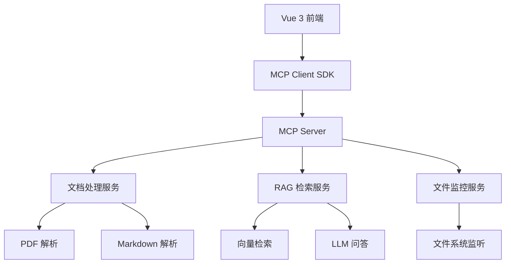

# 架构设计文档

## 1. 技术架构概述

基于功能需求定义，本系统采用前后端分离架构，前端使用 Vue 3 + TypeScript，后端通过 MCP Server 提供文档处理和 RAG 能力。

### 系统架构图



## 2. Vue 3 组件层级设计

### 2.1 组件层级结构

```
App.vue
├── Layout/
│   ├── AppHeader.vue (应用标题和导航)
│   └── AppSidebar.vue (文件夹选择面板)
├── views/
│   ├── DocumentExplorer.vue (文档资源列表)
│   ├── ChatInterface.vue (RAG 问答界面)
│   └── Settings.vue (系统设置)
└── components/
    ├── common/
    │   ├── FileList.vue (文件列表组件)
    │   ├── ChatMessage.vue (聊天消息组件)
    │   └── LoadingSpinner.vue (加载状态组件)
    ├── mcp/
    │   ├── MCPConnection.vue (MCP 连接管理)
    │   └── FileWatcher.vue (文件监听组件)
    └── rag/
        ├── SearchInput.vue (搜索输入框)
        └── ResultDisplay.vue (结果展示组件)
```

### 2.2 核心组件职责

**App.vue** - 应用根组件

- 管理全局状态和路由
- 初始化 MCP 连接
- 错误边界处理

**DocumentExplorer.vue** - 文档资源列表视图

- 显示文件夹选择界面
- 展示文档列表（文件名、大小、修改时间）
- 处理文件夹扫描和错误状态

**ChatInterface.vue** - RAG 问答界面

- 接收用户查询输入
- 显示问答对话历史
- 展示检索结果和来源引用

## 3. @modelcontextprotocol/sdk 集成方案

### 3.1 SDK 安装和配置

```bash
npm install @modelcontextprotocol/sdk
```

### 3.2 MCP Client 封装

```typescript
// src/services/mcp-client.ts
import { Client } from '@modelcontextprotocol/sdk/client/index.js'
import { StdioClientTransport } from '@modelcontextprotocol/sdk/client/stdio.js'

class MCPClientService {
  private client: Client
  private transport: StdioClientTransport

  async connect(serverPath: string, args: string[] = []) {
    this.transport = new StdioClientTransport({
      command: serverPath,
      args: args,
    })

    this.client = new Client(
      {
        name: 'rag-mcp-demo',
        version: '1.0.0',
      },
      {
        capabilities: {
          resources: {},
          tools: {},
        },
      },
    )

    await this.client.connect(this.transport)
  }

  // 文档扫描方法
  async scanDocuments(folderPath: string): Promise<DocumentInfo[]> {
    // 调用 MCP Server 的文档扫描工具
  }

  // RAG 检索方法
  async searchDocuments(query: string): Promise<SearchResult[]> {
    // 调用 MCP Server 的检索工具
  }

  // 文件监听方法
  async watchFolder(folderPath: string): Promise<void> {
    // 调用 MCP Server 的文件监听工具
  }
}
```

### 3.3 Pinia 状态管理

```typescript
// src/stores/mcp-store.ts
import { defineStore } from 'pinia'

export const useMCPStore = defineStore('mcp', {
  state: () => ({
    isConnected: false,
    currentFolder: null as string | null,
    documents: [] as DocumentInfo[],
    searchResults: [] as SearchResult[],
    fileWatchers: [] as FileWatcher[],
  }),

  actions: {
    async connectToServer(serverConfig: ServerConfig) {
      // 连接 MCP Server
    },

    async selectFolder(folderPath: string) {
      // 选择文件夹并扫描文档
    },

    async searchQuery(query: string) {
      // 执行 RAG 检索
    },
  },
})
```

## 4. 后端 MCP Server 交互协议

### 4.1 MCP Server 工具定义

```json
{
  "tools": {
    "scan_documents": {
      "name": "scan_documents",
      "description": "扫描指定文件夹中的文档",
      "inputSchema": {
        "type": "object",
        "properties": {
          "folder_path": {
            "type": "string",
            "description": "要扫描的文件夹路径"
          }
        },
        "required": ["folder_path"]
      }
    },
    "search_documents": {
      "name": "search_documents",
      "description": "基于语义检索相关文档",
      "inputSchema": {
        "type": "object",
        "properties": {
          "query": {
            "type": "string",
            "description": "搜索查询文本"
          },
          "limit": {
            "type": "number",
            "description": "返回结果数量限制"
          }
        },
        "required": ["query"]
      }
    },
    "watch_folder": {
      "name": "watch_folder",
      "description": "监听文件夹变化",
      "inputSchema": {
        "type": "object",
        "properties": {
          "folder_path": {
            "type": "string",
            "description": "要监听的文件夹路径"
          }
        },
        "required": ["folder_path"]
      }
    }
  }
}
```

### 4.2 资源定义

```json
{
  "resources": {
    "document": {
      "uri": "document://{document_id}",
      "mimeType": "application/json",
      "description": "文档信息和内容"
    },
    "folder": {
      "uri": "folder://{folder_path}",
      "mimeType": "application/json",
      "description": "文件夹状态和文档列表"
    }
  }
}
```

### 4.3 消息协议示例

```typescript
// 文档扫描请求
{
  "method": "tools/call",
  "params": {
    "name": "scan_documents",
    "arguments": {
      "folder_path": "/path/to/economics/docs"
    }
  }
}

// 检索请求
{
  "method": "tools/call",
  "params": {
    "name": "search_documents",
    "arguments": {
      "query": "货币政策对经济增长的影响",
      "limit": 5
    }
  }
}
```

## 5. 目录结构方案

### 5.1 前端目录结构

```
src/
├── components/           # 可复用组件
│   ├── common/           # 通用组件
│   ├── mcp/              # MCP 相关组件
│   └── rag/              # RAG 相关组件
├── views/                # 页面级组件
├── stores/               # Pinia 状态管理
│   ├── mcp-store.ts      # MCP 连接状态
│   ├── document-store.ts # 文档管理状态
│   └── chat-store.ts     # 聊天状态
├── services/             # 业务服务层
│   ├── mcp-client.ts     # MCP 客户端封装
│   ├── document-service.ts # 文档处理服务
│   └── rag-service.ts    # RAG 检索服务
├── types/                # TypeScript 类型定义
│   ├── mcp-types.ts      # MCP 相关类型
│   ├── document-types.ts # 文档相关类型
│   └── chat-types.ts     # 聊天相关类型
└── utils/                # 工具函数
    ├── file-utils.ts     # 文件处理工具
    └── validation.ts     # 验证工具
```

### 5.2 后端 MCP Server 目录结构

```
mcp-server/
├── src/
│   ├── tools/            # MCP 工具实现
│   │   ├── document-scanner.ts    # 文档扫描工具
│   │   ├── rag-searcher.ts        # RAG 检索工具
│   │   └── file-watcher.ts        # 文件监听工具
│   ├── services/         # 业务服务
│   │   ├── pdf-parser.ts          # PDF 解析服务
│   │   ├── markdown-parser.ts     # Markdown 解析服务
│   │   └── vector-store.ts        # 向量存储服务
│   ├── types/           # 类型定义
│   └── utils/           # 工具函数
├── package.json
└── tsconfig.json
```

## 6. 技术决策说明

### 6.1 选择 @modelcontextprotocol/sdk 的理由

- **标准化**：遵循 MCP 协议标准，确保兼容性
- **稳定性**：Anthropic 官方维护，质量有保障
- **功能完整**：提供完整的客户端实现和类型定义

### 6.2 选择 Pinia 状态管理的理由

- **Vue 3 官方推荐**：与 Composition API 完美集成
- **TypeScript 支持**：完整的类型推断和检查
- **模块化设计**：便于状态管理和测试

### 6.3 架构设计优势

- **前后端分离**：前端专注 UI 交互，后端专注文档处理
- **协议标准化**：使用 MCP 协议，便于扩展和集成
- **组件化设计**：高内聚低耦合，便于维护和测试

## 7. 验收标准映射

### AC-001 到 AC-003 (文档列表展示)

- **技术实现**：`DocumentExplorer.vue` + `document-scanner.ts`
- **状态管理**：`mcp-store` 中的 `documents` 状态
- **API 调用**：`scan_documents` 工具

### AC-004 到 AC-006 (RAG 检索对话)

- **技术实现**：`ChatInterface.vue` + `rag-searcher.ts`
- **状态管理**：`chat-store` 中的对话历史
- **API 调用**：`search_documents` 工具

### AC-007 到 AC-009 (文件监听)

- **技术实现**：`FileWatcher.vue` + `file-watcher.ts`
- **状态管理**：`mcp-store` 中的 `fileWatchers` 状态
- **API 调用**：`watch_folder` 工具

### AC-010 到 AC-012 (异常处理)

- **技术实现**：全局错误处理 + 组件级错误边界
- **用户提示**：统一的错误提示组件和状态管理

## 8. 性能和安全考虑

### 8.1 性能优化

- **文档扫描**：增量扫描，避免重复处理
- **向量检索**：使用高效的向量索引算法
- **文件监听**：防抖处理，避免频繁更新

### 8.2 安全措施

- **路径验证**：防止目录遍历攻击
- **文件大小限制**：防止内存溢出
- **错误隔离**：单个文件处理失败不影响整体系统
