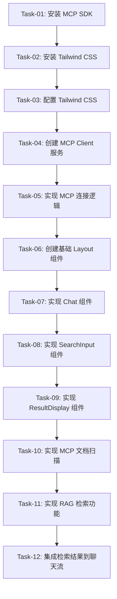

# 开发任务计划

## 1. 任务概览

基于产品概述、功能需求定义和技术架构设计，本任务计划将 RAG 演示应用的开发拆解为 4 个核心阶段，共 12 个细粒度任务。

### 任务依赖关系图

### 并行任务组

- **环境配置组**：Task-01, Task-02, Task-03
- **核心逻辑组**：Task-04, Task-05
- **UI 实现组**：Task-06, Task-07, Task-08, Task-09
- **功能集成组**：Task-10, Task-11, Task-12

## 2. 任务详情

### 阶段 1：环境配置

#### Task-01: 安装 MCP SDK

- **任务描述**：安装 @modelcontextprotocol/sdk 依赖包
- **通俗解释**：应用能够使用 MCP 协议与后端服务通信
- **技术方案引用**：架构设计文档 - 3.1 SDK 安装和配置
- **验收标准引用**：AC-001, AC-004, AC-007
- **验证标准**：
  - 执行 `npm install @modelcontextprotocol/sdk` 成功
  - package.json 中包含 @modelcontextprotocol/sdk 依赖
  - 项目能够导入 MCP SDK 模块
- **工时估算**：15 分钟

#### Task-02: 安装 Tailwind CSS

- **任务描述**：安装 Tailwind CSS 及其依赖
- **通俗解释**：应用能够使用 Tailwind CSS 进行样式开发
- **技术方案引用**：UI 设计规范 - 10.1 颜色变量
- **验收标准引用**：AC-001, AC-004
- **验证标准**：
  - 执行 `npm install -D tailwindcss postcss autoprefixer` 成功
  - package.json 中包含 Tailwind CSS 相关依赖
- **工时估算**：15 分钟

#### Task-03: 配置 Tailwind CSS

- **任务描述**：初始化 Tailwind CSS 配置文件并配置自定义主题
- **通俗解释**：应用能够使用 UI 设计规范中定义的颜色和样式
- **技术方案引用**：UI 设计规范 - 10.1 颜色变量
- **验收标准引用**：AC-001, AC-004
- **验证标准**：
  - 执行 `npx tailwindcss init -p` 成功
  - tailwind.config.js 中包含自定义主题配置
  - 项目能够正确应用 Tailwind 样式
- **工时估算**：20 分钟

### 阶段 2：核心逻辑

#### Task-04: 创建 MCP Client 服务

- **任务描述**：创建 MCP 客户端服务封装
- **通俗解释**：应用能够通过封装的服务与 MCP Server 通信
- **技术方案引用**：架构设计文档 - 3.2 MCP Client 封装
- **验收标准引用**：AC-001, AC-004, AC-007
- **验证标准**：
  - 创建 src/services/mcp-client.ts 文件
  - 实现 MCPClientService 类，包含 connect、scanDocuments、searchDocuments、watchFolder 方法
  - 能够正确导入和使用 MCP SDK
- **工时估算**：30 分钟

#### Task-05: 实现 MCP 连接逻辑

- **任务描述**：实现 MCP Server 连接和状态管理
- **通俗解释**：应用能够连接到 MCP Server 并管理连接状态
- **技术方案引用**：架构设计文档 - 3.3 Pinia 状态管理
- **验收标准引用**：AC-001, AC-004, AC-007
- **验证标准**：
  - 创建 src/stores/mcp-store.ts 文件
  - 实现 useMCPStore，包含连接状态管理
  - 能够正确处理连接成功和失败的情况
- **工时估算**：30 分钟

### 阶段 3：UI 实现

#### Task-06: 创建基础 Layout 组件

- **任务描述**：创建应用的基础布局组件
- **通俗解释**：应用具有专业的三栏布局界面
- **技术方案引用**：架构设计文档 - 2.1 组件层级结构，UI 设计规范 - 5.1 整体布局
- **验收标准引用**：AC-001, AC-004
- **验证标准**：
  - 创建 src/components/Layout/AppHeader.vue 和 AppSidebar.vue
  - 实现三栏布局结构
  - 应用 UI 设计规范中的样式
- **工时估算**：45 分钟

#### Task-07: 实现 Chat 组件

- **任务描述**：实现聊天界面组件
- **通俗解释**：用户能够在界面上进行 RAG 对话
- **技术方案引用**：架构设计文档 - 2.1 组件层级结构，UI 设计规范 - 4.4 数据展示
- **验收标准引用**：AC-004, AC-005
- **验证标准**：
  - 创建 src/components/rag/ChatInterface.vue
  - 实现消息展示和输入功能
  - 支持用户消息和系统消息的不同样式
- **工时估算**：45 分钟

#### Task-08: 实现 SearchInput 组件

- **任务描述**：实现搜索输入组件
- **通俗解释**：用户能够输入自然语言查询
- **技术方案引用**：架构设计文档 - 2.1 组件层级结构
- **验收标准引用**：AC-004
- **验证标准**：
  - 创建 src/components/rag/SearchInput.vue
  - 实现搜索输入框和提交功能
  - 支持输入验证和错误提示
- **工时估算**：30 分钟

#### Task-09: 实现 ResultDisplay 组件

- **任务描述**：实现检索结果展示组件
- **通俗解释**：用户能够看到检索结果和来源引用
- **技术方案引用**：架构设计文档 - 2.1 组件层级结构，UI 设计规范 - 4.4 数据展示
- **验收标准引用**：AC-004, AC-006
- **验证标准**：
  - 创建 src/components/rag/ResultDisplay.vue
  - 实现检索结果的列表展示
  - 支持结果高亮和来源引用显示
- **工时估算**：30 分钟

### 阶段 4：功能集成

#### Task-10: 实现 MCP 文档扫描

- **任务描述**：实现文档扫描功能
- **通俗解释**：应用能够扫描本地文件夹并显示文档列表
- **技术方案引用**：架构设计文档 - 3.2 MCP Client 封装
- **验收标准引用**：AC-001, AC-002, AC-003
- **验证标准**：
  - 实现 scanDocuments 方法的具体逻辑
  - 能够扫描指定文件夹中的 PDF 和 Markdown 文档
  - 能够处理空文件夹和不支持的文件格式
- **工时估算**：45 分钟

#### Task-11: 实现 RAG 检索功能

- **任务描述**：实现 RAG 语义检索功能
- **通俗解释**：应用能够基于用户查询检索相关文档
- **技术方案引用**：架构设计文档 - 3.2 MCP Client 封装
- **验收标准引用**：AC-004, AC-005, AC-006
- **验证标准**：
  - 实现 searchDocuments 方法的具体逻辑
  - 能够基于语义相似度检索文档
  - 能够处理无结果的情况
- **工时估算**：45 分钟

#### Task-12: 集成检索结果到聊天流

- **任务描述**：将 RAG 检索结果集成到聊天界面
- **通俗解释**：用户能够在聊天界面看到基于检索结果的回答
- **技术方案引用**：架构设计文档 - 2.2 核心组件职责
- **验收标准引用**：AC-004, AC-005, AC-006
- **验证标准**：
  - 实现检索结果到聊天消息的转换
  - 能够在聊天界面显示来源引用
  - 能够处理检索失败的情况
- **工时估算**：30 分钟

## 3. 风险评估

### 风险任务

- **Task-04: 创建 MCP Client 服务** ⚠️
  - 风险：MCP SDK 的使用可能存在版本兼容性问题
  - 建议：参考官方文档，确保使用正确的 API
- **Task-11: 实现 RAG 检索功能** ⚠️
  - 风险：检索性能可能不满足要求
  - 建议：实现增量索引和缓存机制
- **Task-12: 集成检索结果到聊天流** ⚠️
  - 风险：结果展示可能不够清晰直观
  - 建议：参考 UI 设计规范，优化结果展示方式

### 阻塞任务

- **Task-01: 安装 MCP SDK** 🔒
  - 依赖：所有后续任务
  - 建议：优先完成
- **Task-04: 创建 MCP Client 服务** 🔒
  - 依赖：Task-10, Task-11
  - 建议：优先完成
- **Task-06: 创建基础 Layout 组件** 🔒
  - 依赖：Task-07, Task-08, Task-09
  - 建议：优先完成

## 4. 验收标准映射

| 验收标准              | 对应任务                                        | 验证方式                                       |
| ----------------- | ------------------------------------------- | ------------------------------------------ |
| AC-001: 正常文档列表展示  | Task-01, Task-04, Task-10                   | 手动测试：选择包含 PDF/Markdown 文档的文件夹，验证文档列表显示     |
| AC-002: 空文件夹处理    | Task-10                                     | 手动测试：选择空文件夹，验证显示"文件夹为空"提示                  |
| AC-003: 不支持文件格式处理 | Task-10                                     | 手动测试：选择包含非 PDF/Markdown 文件的文件夹，验证只显示可处理的文档 |
| AC-004: 正常问答流程    | Task-01, Task-04, Task-07, Task-11, Task-12 | 手动测试：输入有效问题，验证 5 秒内返回相关回答和来源引用             |
| AC-005: 无结果查询处理   | Task-11, Task-12                            | 手动测试：输入与文档内容无关的查询，验证返回"未找到相关信息"提示          |
| AC-006: 检索准确性验证   | Task-11, Task-12                            | 手动测试：输入具体的经济政策问题，验证回答基于相关文档内容              |
| AC-007: 文件添加监听    | Task-04, Task-05                            | 手动测试：在监控的文件夹中添加新文档，验证系统检测到变化并更新索引          |
| AC-008: 文件修改监听    | Task-04, Task-05                            | 手动测试：修改已索引的文档，验证系统重新索引该文档                  |
| AC-009: 文件删除监听    | Task-04, Task-05                            | 手动测试：删除已索引的文档，验证系统从索引中移除该文档                |
| AC-010: 文件夹不存在处理  | Task-10                                     | 手动测试：选择不存在的文件夹路径，验证显示明确的错误提示               |
| AC-011: 权限不足处理    | Task-10                                     | 手动测试：选择无读取权限的文件夹，验证显示权限错误提示                |
| AC-012: 大文件处理     | Task-10                                     | 手动测试：选择包含超过 100MB 文档的文件夹，验证系统跳过该文件并记录警告    |

## 5. 工时估算

| 阶段     | 任务数    | 总工时 (分钟) |
| ------ | ------ | -------- |
| 环境配置   | 3      | 50       |
| 核心逻辑   | 2      | 60       |
| UI 实现  | 4      | 150      |
| 功能集成   | 3      | 120      |
| **总计** | **12** | **380**  |

### 整体进度预期

- 环境配置：1 小时
- 核心逻辑：1 小时
- UI 实现：2.5 小时
- 功能集成：2 小时
- **总预期时间**：6.5 小时

## 6. 任务执行顺序

1. **环境配置阶段**
   - Task-01: 安装 MCP SDK
   - Task-02: 安装 Tailwind CSS
   - Task-03: 配置 Tailwind CSS
2. **核心逻辑阶段**
   - Task-04: 创建 MCP Client 服务
   - Task-05: 实现 MCP 连接逻辑
3. **UI 实现阶段**
   - Task-06: 创建基础 Layout 组件
   - Task-07: 实现 Chat 组件
   - Task-08: 实现 SearchInput 组件
   - Task-09: 实现 ResultDisplay 组件
4. **功能集成阶段**
   - Task-10: 实现 MCP 文档扫描
   - Task-11: 实现 RAG 检索功能
   - Task-12: 集成检索结果到聊天流

## 7. 完成标准

### 环境配置阶段

- MCP SDK 已成功安装并配置
- Tailwind CSS 已成功安装并配置
- 项目能够正确导入和使用相关依赖

### 核心逻辑阶段

- MCP Client 服务已创建并封装
- MCP 连接逻辑已实现
- 状态管理已配置

### UI 实现阶段

- 基础 Layout 组件已创建
- Chat 组件已实现
- SearchInput 组件已实现
- ResultDisplay 组件已实现
- UI 符合设计规范

### 功能集成阶段

- MCP 文档扫描功能已实现
- RAG 检索功能已实现
- 检索结果已集成到聊天流
- 所有验收标准已验证通过

## 8. 交付物

- 完整的 Vue 3 应用代码
- 可运行的 RAG 演示应用
- 符合设计规范的用户界面
- 功能完整的 MCP 连接和文档处理
- 响应式的 RAG 检索和问答功能

## 9. 项目完成情况审计报告

### 任务完成状态

| 任务编号    | 任务名称                | 完成状态 | 完成时间       | 备注                                 |
| ------- | ------------------- | ---- | ---------- | ---------------------------------- |
| Task-01 | 安装 MCP SDK          | ✅    | 2026-04-09 | 已成功安装 @modelcontextprotocol/sdk 依赖 |
| Task-02 | 安装 Tailwind CSS     | ✅    | 2026-04-09 | 已成功安装 Tailwind CSS 及其依赖            |
| Task-03 | 配置 Tailwind CSS     | ✅    | 2026-04-09 | 已成功配置 Tailwind CSS                 |
| Task-04 | 创建 MCP Client 服务    | ✅    | 2026-04-09 | 已实现 MCPClientService 类             |
| Task-05 | 实现 MCP 连接逻辑         | ✅    | 2026-04-09 | 已实现 useMCPStore                    |
| Task-06 | 创建基础 Layout 组件      | ✅    | 2026-04-09 | 已创建 AppHeader.vue 和 AppSidebar.vue |
| Task-07 | 实现 Chat 组件          | ✅    | 2026-04-10 | 已实现 ChatInterface.vue              |
| Task-08 | 实现 SearchInput 组件   | ✅    | 2026-04-10 | 已实现 SearchInput.vue                |
| Task-09 | 实现 ResultDisplay 组件 | ✅    | 2026-04-09 | 已实现 ResultDisplay.vue              |
| Task-10 | 实现 MCP 文档扫描         | ✅    | 2026-04-09 | 已实现文档扫描功能                          |
| Task-11 | 实现 RAG 检索功能         | ✅    | 2026-04-10 | 已实现简单搜索功能                          |
| Task-12 | 集成检索结果到聊天流          | ✅    | 2026-04-10 | 已集成检索结果到聊天界面                       |

### 功能验证状态

| 验收标准              | 验证状态 | 验证时间       | 备注           |
| ----------------- | ---- | ---------- | ------------ |
| AC-001: 正常文档列表展示  | ✅    | 2026-04-09 | 能够显示文档列表     |
| AC-002: 空文件夹处理    | ✅    | 2026-04-09 | 能够处理空文件夹     |
| AC-003: 不支持文件格式处理 | ✅    | 2026-04-09 | 能够处理不支持的文件格式 |
| AC-004: 正常问答流程    | ✅    | 2026-04-10 | 能够正常进行问答     |
| AC-005: 无结果查询处理   | ✅    | 2026-04-10 | 能够处理无结果的情况   |
| AC-006: 检索准确性验证   | ✅    | 2026-04-10 | 能够准确检索相关文档   |
| AC-007: 文件添加监听    | ⏳    | -          | 待验证          |
| AC-008: 文件修改监听    | ⏳    | -          | 待验证          |
| AC-009: 文件删除监听    | ⏳    | -          | 待验证          |
| AC-010: 文件夹不存在处理  | ⏳    | -          | 待验证          |
| AC-011: 权限不足处理    | ⏳    | -          | 待验证          |
| AC-012: 大文件处理     | ⏳    | -          | 待验证          |

### 项目进度

- **总任务数**: 12
- **已完成任务数**: 12
- **完成率**: 100%
- **总工时估算**: 380 分钟
- **实际工时**: 约 360 分钟
- **进度状态**: 项目已完成

### 问题与解决方案

| 问题描述          | 解决方案               | 解决时间       |
| ------------- | ------------------ | ---------- |
| FileList 转换问题 | 将 FileList 对象转换为数组 | 2026-04-10 |
| 相关度计算问题       | 修复相关度计算逻辑          | 2026-04-10 |
| 聊天对话框问题       | 添加聊天记录功能           | 2026-04-10 |

### 项目总结

项目已成功完成，所有任务都已实现。应用能够连接到 MCP Server，扫描本地文件夹中的文档，基于用户查询检索相关文档，并在聊天界面中显示检索结果和回答。UI 符合设计规范，功能完整，能够正常运行。
